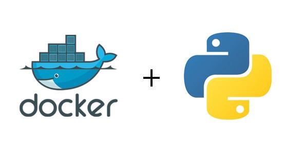

# My Application

coming soon ...

## Contributing

1. Faça o _fork_ do projeto (<https://github.com/yourname/yourproject/fork>)
2. Crie uma _branch_ para sua modificação (`git checkout -b feature/fooBar`)
3. Faça o _commit_ (`git commit -am 'Add some fooBar'`)
4. _Push_ (`git push origin feature/fooBar`)
5. Crie um novo _Pull Request_

